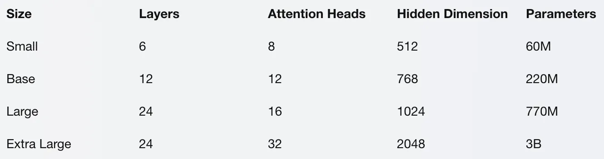

.. meta::
   :description: 了解 T5 如何成为可以处理各种自然语言处理任务的文本传输转换器。
   :twitter:description: 了解 T5 如何成为可以处理各种自然语言处理任务的文本传输转换器。

T5：文本迁移转换器
============================================
.. rst-class:: lead

    了解 T5 如何成为可以处理各种自然语言处理任务的文本传输转换器。

引言
-------------------------------------------------------------------------------
T5 是一个先进的模型，能够基于各种输入（比如文本、图片、表格和图形）生成自然语言文本。它还能进行文本摘要、问答、文本分类、翻译等任务。

但是，文本迁移学习竟是什么？T5 如何运作？在 NLP 任务中使用 T5 有哪些优势和挑战？你如何在自己的项目中应用 T5？这篇文章将回答这些问题。

文本迁移学习是什么？
-------------------------------------------------------------------------------

**文本迁移学习是一种技术，通过这种技术，模型能够学习海量文本数据** ，然后将这些知识应用于不同的自然语言处理任务。这种方法的核心思想是使用一个能够将任何文本作为输入，并根据任务生成任何文本作为输出的单一模型。例如，模型可以接受一句话作为输入，并输出一个释义、摘要、翻译、问题、答案或分类标签。

**文本迁移学习相比传统自然语言处理方法有几个优势** 。首先，它简化了模型架构，减少了参数数量，因为同一模型能够处理多项任务。其次，它利用了预训练的威力，这意味着在针对特定任务微调之前，模型可以从大量多样的文本数据中学习。这样，模型能够捕获通用语言知识，并将其迁移到不同领域和任务。第三，它实现了零样本和小样本学习，这意味着模型能够执行在训练期间未见过的任务，或仅见过少数示例的任务，通过使用自然语言提示或指令。

**然而，文本迁移学习也存在一些挑战和局限** 。一个挑战是如何为不同任务设计有效且一致的输入和输出格式，因为模型需要从文本本身理解任务。另一个挑战是如何评估模型在不同任务上的表现，因为没有单一指标能够衡量生成文本的质量和多样性。一个局限是，模型可能无法处理超出文本范畴的任务，如涉及图像、音频、视频或结构化数据的任务。

**在接下来的部分，我们将探讨T5——一种文本迁移转换器，它是如何克服这些挑战和局限，以及如何在各种自然语言处理任务上取得最先进成果的。**

T5 的工作原理
-------------------------------------------------------------------------------

T5 是一个能够将任何文本输入转换为任何文本输出，从而执行多种自然语言处理任务的文本迁移转换器。T5 通过使用一个大型的基于 Transformer 架构的神经网络模型来工作，该模型由编码器和解码器组成。编码器将输入文本转换为一系列隐藏表示或嵌入，捕获文本的含义和上下文。解码器然后利用这些嵌入，通过一种称为自回归生成的技术，逐字生成输出文本。

为了训练 T5，作者使用了一个大型且多样化的文本数据集，名为 Colossal Clean Crawled Corpus (C4)，包含约 750GB 的网络文本。他们在这个语料库上预训练 T5，使用单一目标：掩码语言建模。这意味着他们随机掩盖输入文本中的一些词或词组，并让 T5 根据周围上下文预测被掩盖的词。这样，T5 学会了理解和生成来自各种领域和类型的自然语言文本。

预训练后，T5 可以通过使用特定任务的输入和输出格式进行微调。例如，要进行文本摘要，输入格式可以是 “summarize: ” 后跟摘要的文本，输出格式是摘要文本。要进行翻译，输入格式可以是 “translate English to French: ” 后跟英文文本，输出格式是法文文本。进行文本分类时，输入格式是待分类的文本，输出格式是类别标签。通过这些格式，T5 能够学习执行不同任务，而无需改变模型架构或目标函数。

T5的架构与预训练
-------------------------------------------------------------------------------

T5 基于 Transformer 架构，这是一个利用注意力机制来学习文本中的单词和句子之间关系的神经网络模型。Transformer 架构主要由两部分组成：编码器和解码器。编码器将输入文本转换为一系列隐藏表示或嵌入，捕获文本的含义和上下文。解码器接着利用这些嵌入，通过自回归生成技术，逐字生成输出文本。

T5 架构与原始 Transformer 架构相似，但进行了一些修改和改进。主要区别包括：

- T5 采用相对位置嵌入，使模型能够学习文本中单词的相对位置，而非绝对位置，从而处理更长的文本和变长的输入输出。
- T5 在编码器和解码器中使用共享词汇表和共享嵌入层，意味着模型能够对输入和输出文本使用相同的词元和嵌入，这减少了参数数量，提高了模型的效率和泛化能力。
- T5 使用可逆残差网络，使模型能够并行计算编码器和解码器的梯度，而非顺序计算，降低了内存消耗，加快了训练过程。
- T5 采用 0.1 的丢弃率，即在训练期间随机丢弃每层中 10% 的单元，这有助于防止过拟合，增强模型的鲁棒性和多样性。

作者还测试了不同大小的 T5 模型，从小型到超大型。T5 的大小决定了模型的层数、注意力头的数量和隐藏维度。模型越大，拥有的参数和计算能力越多，但同时也需要更多的数据和训练时间。下表展示了 T5 的不同大小和参数：

T5的微调与评估
-------------------------------------------------------------------------------

在 C4 语料库上预训练完成后，作者在多种自然语言处理任务上对T5进行了微调，例如文本摘要、问答、文本分类、翻译等。根据前述部分描述的特定任务输入输出格式进行微调。例如，对于 CNN/Daily Mail 摘要任务，输入格式是“summarize: ”后跟新闻文章，输出格式是摘要文本。对于 SQuAD 问答任务，输入格式是问题后跟上下文段落，输出格式是答案文本。

为了评估 T5 在不同任务上的表现，作者采用了多种度量指标来衡量生成文本的质量和多样性。例如，在文本摘要任务上，使用 ROUGE 分数来比较生成摘要与参考摘要之间的 n-gram 重叠。在问答任务上，使用准确匹配和F1分数来衡量生成答案与参考答案之间的准确性和召回率。在文本分类任务上，使用准确率分数来衡量正确预测标签的百分比。

作者将 T5 与专门用于每项任务的其他模型进行了比较，如 BERT、XLNet、GPT-2 和 BART。他们发现 T5 在大多数任务上超过或匹配了最先进的结果，尤其是在更大的模型尺寸上。他们还发现 T5 比其他模型更高效和可扩展，因为它使用更少的参数和计算时间就能达到相似或更好的结果。下表展示了 T5 在一些任务上的性能和效率：

T5 的应用案例
-------------------------------------------------------------------------------

我们介绍一些使用 T5 进行文本生成、文本摘要、问答、文本分类和翻译的案例。还会展示如何使用 Hugging Face Transformers 库在你的项目中轻松地访问和使用 T5 及其他模型。

**文本生成**

文本生成是根据不同类型的输入（如文本、图片、表格和图形）生成自然语言文本的任务。T5通过接收任何文本作为输入并根据任务产生任何文本作为输出，来执行文本生成任务。例如，T5可以利用自然语言提示或指令来生成诗歌、故事、代码、论文、歌曲、名人恶搞等。

以下是一些使用T5进行文本生成的示例：

- 输入：写一首关于冬天的俳句
- 输出：雪花纷纷落下 覆盖大地以白 冬天寂静无声
- 输入：写一个关于龙和公主的短故事
- 输出：龙孤独地生活在山洞中，渴望有个朋友。一天，它遇到了美丽的公主Rose。他们成为了朋友，甚至更亲密。但当王子到来，婚礼即将举行时，Rose决定与龙一起逃离，他们一起飞向自由，从此幸福地生活在一起。
- 输入：写一条唐纳德·特朗普的恶搞推特
- 输出：假新闻媒体正不遗余力地散布关于我和我的政府的谎言。他们是人民的敌人，应该感到羞耻。他们对我们国家非常不利，很快就会消失。让美国再次伟大！

**文本摘要**

文本摘要是将较长文本（如新闻文章、研究论文或书籍）生成简洁准确摘要的任务。T5 通过接收要摘要的文本作为输入，产生摘要文本作为输出，来执行文本摘要任务。为了指明输入是需要摘要的文本，T5 使用前缀“summarize: ”。

以下是一些使用T5进行文本摘要的示例：

- 输入：summarize: 新冠疫情，也称为冠状病毒疫情，是一场由 SARS-CoV-2 引起的全球性疫情。该病毒最早于2019年12月在中国武汉被发现。世界卫生组织于2020年1月30日宣布这是国际关注的突发公共卫生事件，并于2020年3月11日宣布疫情。截至2020年11月29日，已确认超过6260万例病例，与新冠病毒相关的死亡超过145万例。
- 输出：新冠疫情是一场全球性健康危机，由2019年底在中国首次发现的新冠状病毒引起。该病毒已传播到全球几乎每个国家，导致数百万人感染和死亡。世界卫生组织已将其宣布为大流行病和公共卫生紧急事件。
- 输入：summarize: 《狮子王》是一部1994年由华特迪士尼动画制作并由华特迪士尼影片发行的美国动画音乐剧情片。它是迪士尼第32部动画特色电影，也是被称为迪士尼文艺复兴时期的第五部动画电影。《狮子王》由Roger Allers和Rob Minkoff执导，Don Hahn制作，剧本归功于Irene Mecchi、Jonathan Roberts和Linda Woolverton。它的原创歌曲由作曲家Elton John和作词家Tim Rice创作，配乐由Hans Zimmer完成。该片拥有一个包括Matthew Broderick、James Earl Jones、Jeremy Irons、Jonathan Taylor Thomas、Moira Kelly、Nathan Lane、Ernie Sabella、Rowan Atkinson、Robert Guillaume、Madge Sinclair（在她最后一部电影角色中）、Whoopi Goldberg、Cheech Marin和Jim Cummings在内的声音演员阵容。故事发生在非洲的一个狮子王国，受到了圣经故事约瑟夫和摩西，以及威廉·莎士比亚的《哈姆雷特》的影响。
- 输出：《狮子王》是一部迪士尼动画电影，讲述了辛巴——一只年轻狮子的故事，他注定要成为他的族群的王。然而，他的叔叔斯卡谋杀了他的父亲木法沙，并误导辛巴认为自己要为此负责。辛巴逃离并流亡，在流亡中结识了蒂蒙和彭彭。几年后，他被说服回家并从斯卡手中夺回王位。这部电影受到圣经和莎翁《哈姆雷特》的启发，并包含了Elton John和Tim Rice的歌曲。
- 输入：summarize: 光合作用是植物和其他生物利用光能转化为化学能的过程，这些化学能随后可以通过细胞呼吸释放，以供生物体的代谢活动使用。这种化学能储存在碳水化合物分子中，如糖类，这些糖类是从二氧化碳和水合成的——因此得名光合作用，来自希腊语phōs（φῶς，“光”）和sunthesis（σύνθεσις，“结合”）。在大多数情况下，氧气也作为废物释放。大多数植物、藻类和蓝细菌执行光合作用；这样的生物被称为光自养生物。光合作用在很大程度上负责产生和维持地球大气中的氧气含量，并为地球上的生命提供大部分所需的能量。
- 输出：光合作用是一个将光能转化为细胞可以使用的化学能的过程。它通过将二氧化碳和水转化为碳水化合物，并释放氧气作为副产品来完成。这个过程由植物、藻类和某些细菌执行，这些生物被称为光自养生物。光合作用对维持地球的氧气平衡和生命所需能量至关重要。

**问答**

问答任务是根据给定的上下文或知识源，对自然语言问题生成自然语言答案。T5 通过将问题和上下文作为输入，并生成答案作为输出，来执行问答任务。为了表明输入是一个问题和上下文，T5 使用问题后跟上下文，中间用换行符（\n）分隔。

总结
-------------------------------------------------------------------------------

T5 是一个功能强大且多用途的模型，能够基于各种类型的输入（如文本、图片、表格和图形）生成自然语言文本。它能执行文本摘要、问答、文本分类、翻译等任务。T5 基于 Transformer 架构，利用注意力机制学习文本中单词和句子之间的关系。T5 在一个大型且多样化的文本数据集 C4 上进行了预训练，使用掩码语言建模作为单一目标。之后，T5 通过特定任务的输入和输出格式进行了微调。在大多数任务上，T5 超越或匹配了最先进的结果，尤其是在更大的模型尺寸上。T5 也比其他模型更高效和可扩展，因为它使用更少的参数和计算时间就能达到相似或更好的结果。